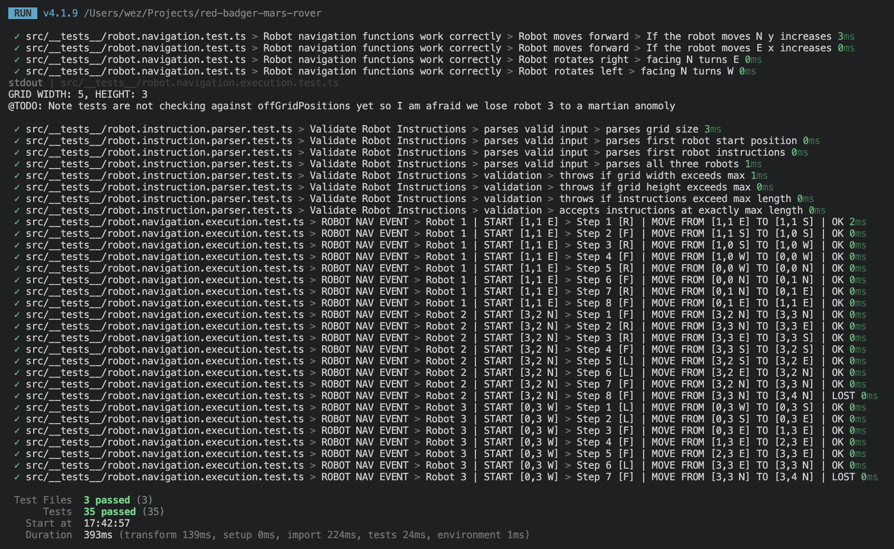

# Red Badger Mars Rover Tech Test

## To Run

Presuming you have npm installed, clone the repo then run:
```bash
npm install
npm run test
```

You will see "ROBOT NAV EVENT" rows in the test output as per screenshot:



## To use a different robots program
Edit this file: 
[src/robot.instruction.data.ts](src/robot.instruction.data.ts)

## Initial Thinking

[docs/reasoning.md](docs/reasoning.md)

Note: I used some intellisense as I decided not to turn it off. I did not utilise AI in the modern use sense e.g. Claude Code + MD files or vibe coding with a chat window.

My primary thought was to parse the instruction logic into a typesafe object that I could then work with in the test environment. The parse function took a little longer than I thought it would however it worked well to deliver *something*.

## Next Steps

1. I did not finish the lost robot local state function, so extend navigateStep to finish that off.
2. I would not take this project forward. I would instead utilise Claude Code + Python + notebook + API + autogen solution. The tech stack was chosen for delivery confidence.

## Retrospective

Using a better output format even console.log from an API instead of test output may have been better, however the result is interesting!


